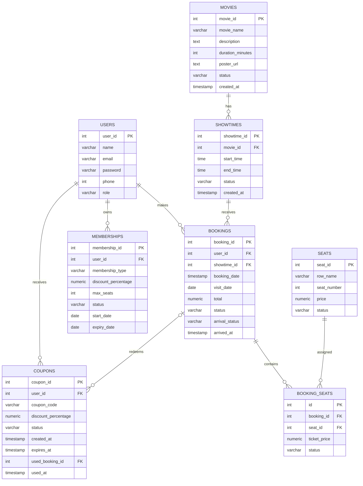

# Cinema Seat Booking System - ER Diagram

```mermaid
erDiagram

    USERS ||--o{ BOOKINGS : makes
    USERS ||--o{ COUPONS : receives
    USERS ||--o{ MEMBERSHIPS : owns

    MOVIES ||--o{ SHOWTIMES : has

    SHOWTIMES ||--o{ BOOKINGS : receives

    BOOKINGS ||--o{ BOOKING_SEATS : contains
    SEATS ||--o{ BOOKING_SEATS : assigned

    BOOKINGS o|--o{ COUPONS : redeems

    USERS {
        int user_id PK
        varchar name
        varchar email
        varchar password
        int phone
        varchar role
    }

    MOVIES {
        int movie_id PK
        varchar movie_name
        text description
        int duration_minutes
        text poster_url
        varchar status
        timestamp created_at
    }

    SHOWTIMES {
        int showtime_id PK
        int movie_id FK
        time start_time
        time end_time
        varchar status
        timestamp created_at
    }

    SEATS {
        int seat_id PK
        varchar row_name
        int seat_number
        numeric price
        varchar status
    }

    BOOKINGS {
        int booking_id PK
        int user_id FK
        int showtime_id FK
        timestamp booking_date
        date visit_date
        numeric total
        varchar status
        varchar arrival_status
        timestamp arrived_at
    }

    BOOKING_SEATS {
        int id PK
        int booking_id FK
        int seat_id FK
        numeric ticket_price
        varchar status
    }

    COUPONS {
        int coupon_id PK
        int user_id FK
        varchar coupon_code
        numeric discount_percentage
        varchar status
        timestamp created_at
        timestamp expires_at
        int used_booking_id FK
        timestamp used_at
    }

    MEMBERSHIPS {
        int membership_id PK
        int user_id FK
        varchar membership_type
        numeric discount_percentage
        int max_seats
        varchar status
        date start_date
        date expiry_date
    }
```
